# OwnIt Uganda App - Product Screen Guide & Documentation

This document provides a detailed visual guide of all the screens and workflows built into the OwnIt Uganda application, featuring functional descriptions and captured mobile screenshots.

## Introduction
**OwnIt Uganda** is a crowd funding platform designed to democratize high-value real asset co-ownership in Uganda. The platform allows everyday users to purchase fractional equity in premium assets (including real estate, import trade lots, agricultural exports, infrastructure, and green energy) starting from as low as UGX 50,000. Passive returns are paid out directly to MTN and Airtel Mobile Money wallets.

***

## 1. Onboarding & Authentication Flow

### 1.1 Welcome & Onboarding Screen
The Welcome Screen is the first point of contact for users. It features an automatic sliding carousel highlighting the core features of the platform: co-owning real assets, earning passive profit shares, and growing wealth. Users can see quick statistics (500K+ Investors, 100+ Assets, 14-32% Avg Yield) and choose to either 'Get Started' to sign up or select 'I already have an account' to log in.

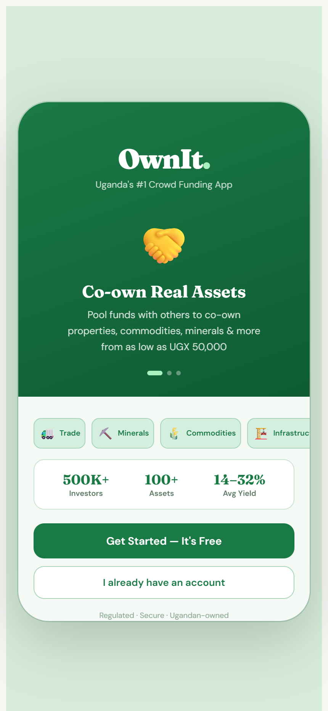

### 1.2 Sign Up / Registration Screen
The Sign Up flow is a simple 3-step wizard designed for quick onboarding. Step 1 allows users to select their user type: either an 'Investor' (who buys fractional shares) or an 'Asset Lister' (who lists properties/trade deals). It collects basic personal info including Name, Email, and Phone, and guides the user to set up a secure password.

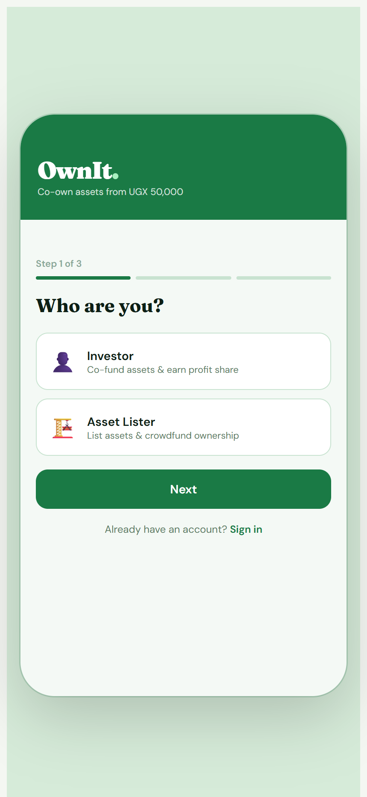

### 1.3 Sign In / Login Screen
The Sign In Screen provides a clean authentication interface. Users select their role (Investor or Asset Lister), enter their email/phone credentials, and type their password (with a visibility toggle). It also includes links for 'Forgot password?' and switching back to the Sign Up flow.

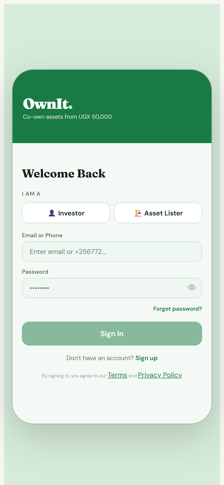

### 1.4 Forgot Password Screen
If users forget their password, this screen enables them to enter their registered email address or phone number to receive a secure recovery code. It features form validation and a quick back button to return to the sign-in screen.

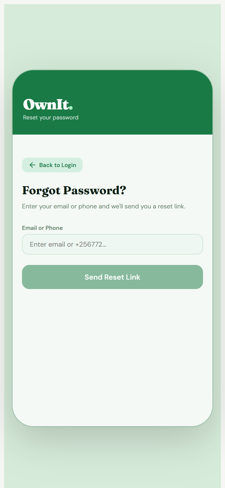

### 1.5 KYC Verification Screen (Step 1)
To ensure regulatory compliance and build security, the app includes a 3-step digital KYC verification flow. Step 1 gathers personal details: Date of Birth, Nationality selection, Residential Address, and current Occupation. Users who wish to try out the app first can choose to 'Skip for Now'.

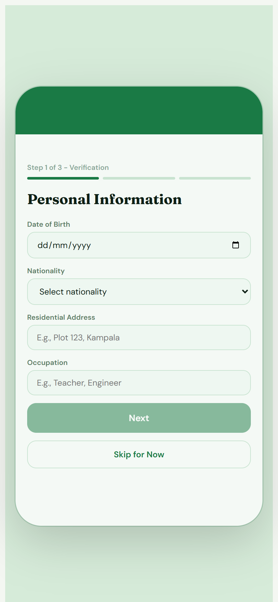

***

## 2. Investor Experience

### 2.1 Investor Dashboard (Discover Tab)
Once authenticated, investors land on the Discover Tab. The dashboard shows a greeting, a brief overview of their active portfolio value, monthly passive income, and a list of co-ownership opportunities. Each asset card displays an emoji representation, location, category (Real Estate, Trade, Commodities, Minerals, Infrastructure), minimum investment threshold, expected annual yield, and a real-time funding progress bar.

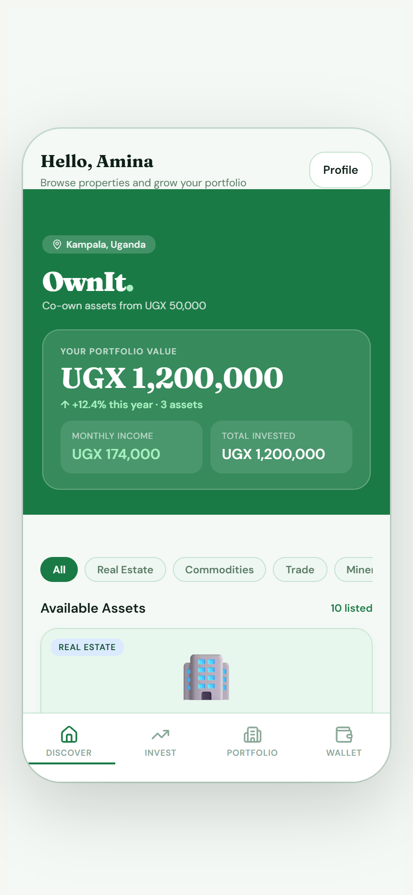

### 2.2 Vetted Asset Details Screen
Clicking any asset card opens the detailed property page. This view includes location data, total fundraising valuation, current investor count, a descriptive paragraph, a list of verified investor perks, key legal terms, and a dynamic ROI calculator showing the projected returns based on a co-ownership stake.

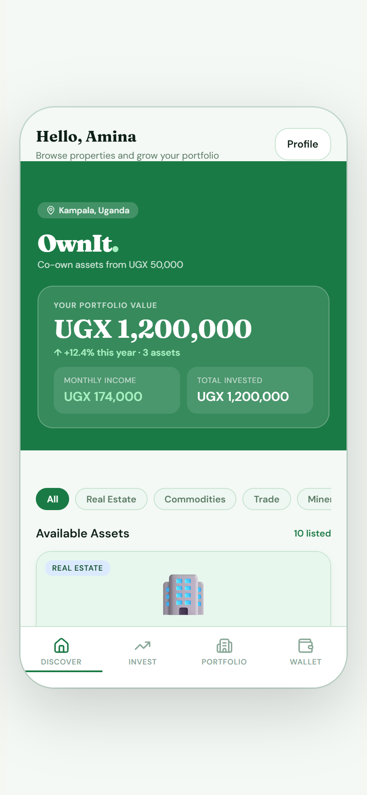

### 2.3 Investment Flow - Step 1: Amount Selection
When users click 'Invest', they enter a 4-step checkout flow. Step 1 features an interactive range slider allowing investors to select their desired investment amount (minimum UGX 50,000 up to 25% of the asset's total value). It calculates the exact ownership percentage and projected monthly income dynamically.

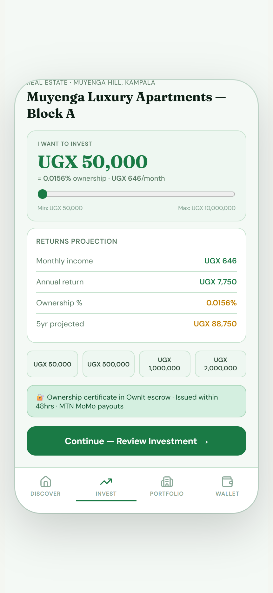

### 2.4 Investment Flow - Step 2: Review Returns
Step 2 presents a summary breakdown of the selected investment: the exact UGX amount, calculated ownership percentage, estimated monthly income, and annual returns. This ensures transparency before the transaction is executed.

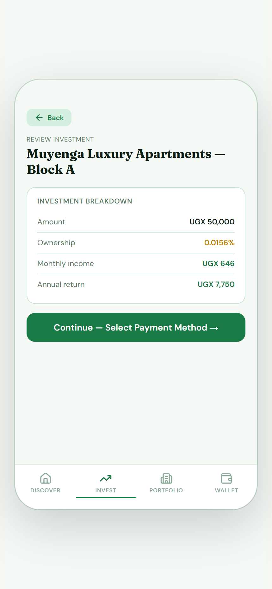

### 2.5 Investment Flow - Step 3: Payment Method
Step 3 lets users select their preferred payment provider. It supports popular local options: MTN Mobile Money, Airtel Money, Bank Transfer, and Credit/Debit Card payments. Selecting a method displays specific provider tips (e.g., account details or USSD prompt hints).

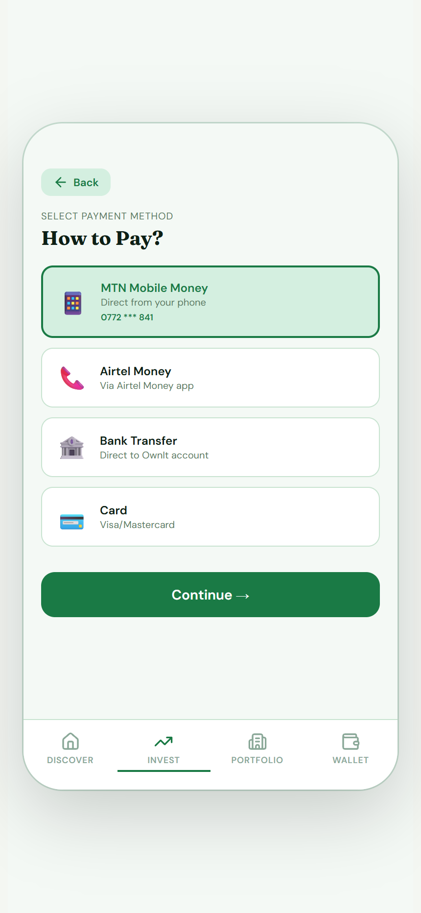

### 2.6 Investment Flow - Step 4: Final Confirmation
Step 4 presents the final transaction summary, displaying payment information (e.g., MTN Mobile Money number) and a prompt to confirm co-ownership terms. Capital risk disclaimers are shown clearly before the user clicks to confirm and pay.

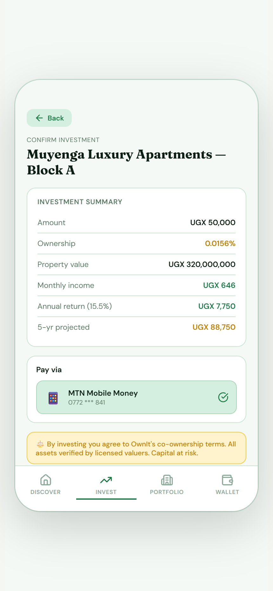

### 2.7 Investment Flow - Step 5: Success & Escrow Confirmation
Upon successful payment, users see a success screen confirming their new co-ownership status. It displays their final ownership percentage and monthly passive income, confirming that their asset share has been secured in escrow and a certificate will be issued within 48 hours.

### 2.8 Invest List Tab
The Invest Tab provides a structured list of all active listings on the platform. It allows users to quickly scan and compare yields, locations, and asset classes, with direct navigation to open details and start a co-ownership transaction.

### 2.9 Portfolio Tracking Ledger
The Portfolio Screen aggregates all of the investor's active stakes. It displays total portfolio value, accumulated monthly passive income, average yield, and individual project cards showing the amount invested, monthly payouts, and ownership percentage in each asset.

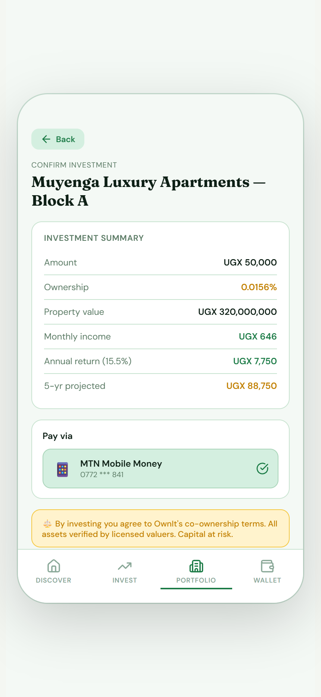

### 2.10 Smart Local Wallet Tab
The Wallet Screen displays the investor's ledger. It lists their available balance, current month's earnings, and features quick buttons for deposits and withdrawals. It also displays payout settings (frequency and MTN Mobile Money destination account) and detailed transaction history.

***

## 3. Asset Lister Experience

### 3.1 Asset Lister Overview Dashboard
Asset Listers have access to a dedicated overview portal. The dashboard summarizes the total valuation of their listed assets, fundraising progress, active co-investors count, and monthly payout disbursements due.

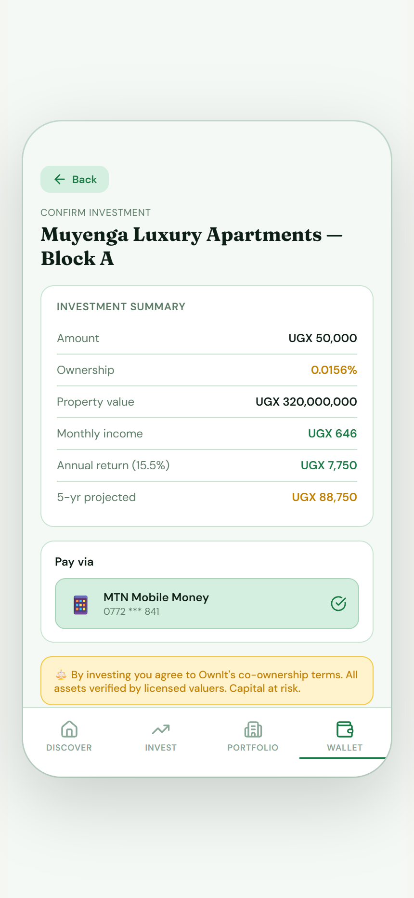

### 3.2 Lister Co-investors Ledger
Listers can view a compiled ledger of all individual investors who have co-funded their assets. It tracks individual investment amounts, ownership percentages, and yield ratios to manage co-owner relations.

### 3.3 Lister Scheduled Payouts Portal
The Lister Payouts page lists all past payout disbursements and schedules the next payout date. It provides full transparency for managing monthly rental distributions or trade-yield profit sharing to co-owners.

